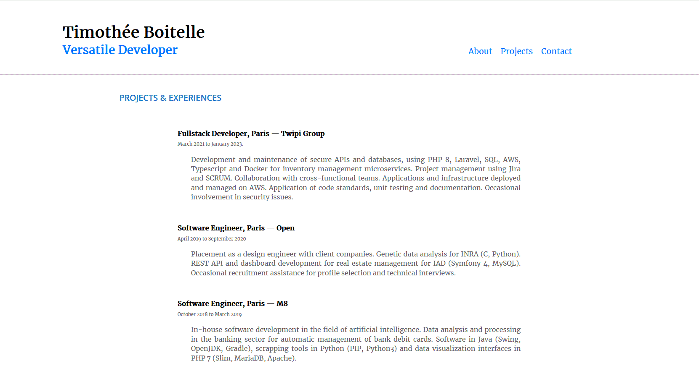

# Portfolio ⚡️ [](https://github.com/tiboitel/portfolio/blob/main/LICENSE)  

## A minimal portfolio showcasing my work as a developer!

<h2 align="center">
  
  <br>
</h2>

## Features

⚡️ Minimalist UI Design \
⚡️ One Page Layout\
⚡️ Styled with Custom SCSS\
⚡️ Valid HTML5 & CSS3

---

## Why a Portfolio Matters ☝️

- A professional way to showcase my projects and skills
- Increases my online visibility and presence
- Demonstrates that I'm more than just a resume

## Getting Started 🚀

These instructions will guide you to set up and run a copy of the project on your local machine for development and testing purposes. Detailed notes on deployment can be found below.

### Prerequisites 📋

You need to have [Git](https://git-scm.com) and [Node.js](https://nodejs.org/en/download/) (which comes with [NPM](http://npmjs.com)) installed on your computer.

```
node@v18.0.0 or higher
npm@7.18.1 or higher
git@2.30.1 or higher
gulp@4.0.1 or higher
```

## How To Use 🔧

1. Clone the repository and navigate to it in the terminal:

```bash
# Clone the repository
$ git clone https://github.com/tiboitel/portfolio/

# Move into the repository
$ cd portfolio

# Remove the current origin repository
$ git remote remove origin

```

2. Install the project's dependencies:

Using NPM:

```bash
# Update dependencies
$ npm audit fix

# Install Gulp
$ npm install --global gulp

# Install dependencies
$ npm install
```


3. Run the development server:

Using PHP built-in HTTP server:

```bash
# Build typescript and sass.
$ gulp build

# Run HTTP Server.
$ php -S localhost:1234 # OR any other HTTP Server.
```

4. Once the server starts, go to `http://localhost:1234/` in your browser to see your portfolio locally.

---

## Customizing the Template:

### Changing Project Details

- Modify the content in `/src/index.html` to personalize each section with your own details.

### Changing Color Theme

- Edit color variables in `/src/sass/styles.scss` to change the color theme of the website.

### Adding Projects

- Add or remove projects in the Projects section (`#projects`) of `/src/index.html`.

### Contact Section

- Modify the contact details in the Contact section (`#contact`) of `/src/index.html`.

---

## Deployment 📦

To deploy my portfolio online, I recommend using [Netlify](https://netlify.com) for its ease of use.

## Technologies Used 🛠️

- [Typescript](https://www.typescriptlang.org/) - Typed superset of JavaScript
- [Sass](https://sass-lang.com/documentation) - CSS extension language
- [Gulp](https://gulpjs.com/) - Task runner for web development

## Acknowledgments 🎁


## License 📄

This project is licensed under the MIT License - see the [LICENSE](LICENSE) file for details.

## Author

- **tiboitel** - [GitHub Profile](https://github.com/tiboitel)

## Status

Coming Soon !
